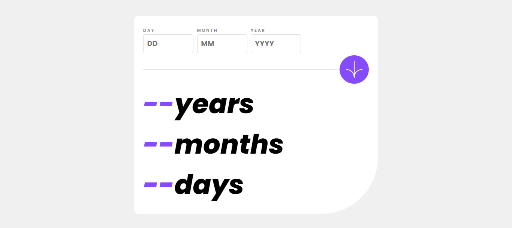

# Frontend Mentor - Age calculator app solution

This is a solution to the [Age calculator app challenge on Frontend Mentor](https://www.frontendmentor.io/challenges/age-calculator-app-dF9DFFpj-Q). Frontend Mentor challenges help you improve your coding skills by building realistic projects.

## Table of contents

- [Overview](#overview)
  - [The challenge](#the-challenge)
  - [Screenshot](#screenshot)
  - [Links](#links)
- [My process](#my-process)
  - [Built with](#built-with)
  - [What I learned](#what-i-learned)
  - [Continued development](#continued-development)
  - [Useful resources](#useful-resources)
- [Author](#author)
- [Acknowledgments](#acknowledgments)

## Overview

### The challenge

Users should be able to:

- View an age in years, months, and days after submitting a valid date through the form
- Receive validation errors if:
  - Any field is empty when the form is submitted
  - The day number is not between 1-31
  - The month number is not between 1-12
  - The year is in the future
  - The date is invalid e.g. 31/04/1991 (there are 30 days in April)
- View the optimal layout for the interface depending on their device's screen size
- See hover and focus states for all interactive elements on the page
- **Bonus**: See the age numbers animate to their final number when the form is submitted

### Screenshot



### Links

- Solution URL: [Add solution URL here](https://your-solution-url.com)
- Live Site URL: [Add live site URL here](https://your-live-site-url.com)

## My process

### Built with

- Semantic HTML5 markup
- CSS custom properties
- Flexbox
- Mobile-first workflow
- Vanilla Javascript

### What I learned

I learned to correctly insert fonts and what actually means box sizing property.

```css
@font-face {
  font-family: "Poppins";
  src: url("../assets/fonts/Poppins-Regular.ttf"),
    url("../assets/fonts/Poppins-Italic.ttf");
  font-weight: 400;
  font-style: normal;
}
@font-face {
  font-family: "Poppins Bold";
  src: url("../assets/fonts/Poppins-ExtraBoldItalic.ttf");
  font-weight: 900;
  font-style: italic;
}
@font-face {
  font-family: "Poppins Semi-Bold";
  src: url("../assets/fonts/Poppins-Bold.ttf");
}
:root {
  --purple: hsl(259, 100%, 65%);
  --light-grey: hsl(0, 0%, 86%);
  --smoke-grey: hsl(0, 1%, 44%);
}
```

I don't have too much time for learning new stuffs, That's Why I'm making some projects for not forgetting
anything.

### Continued development

I will focus on project with OOP then I'll write some backend sites.

### Useful resources

- [CHATGPT](https://www.chatgpt.com) - This helped me for new technics and some features that I could forget during the project. I really liked this pattern and will use it going forward.

## Author

NAME: WINNER NDAKUTEMO
AGE: 15
DATE: 10/31th/2024

- Frontend Mentor - [@winnerndakutemo](https://www.frontendmentor.io/profile/winnerndakutemo)
- Youtube - [@codeavecwinner](https://www.twitter.com/codeavecwinner)

## Acknowledgments

Thank to Jesus For giving me knowledge.
Thank to The LORD OF HOST, KING OF GLORY, The Holy Governor: KING HOLY SPIRIT
THANK TO GOD THE FATHER FOR LOVING ME.
